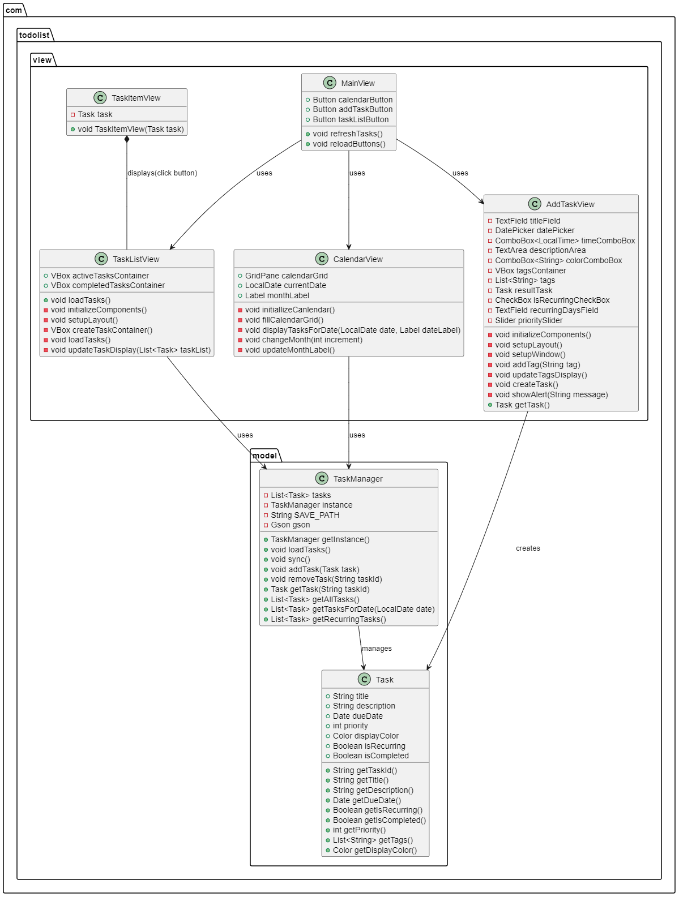
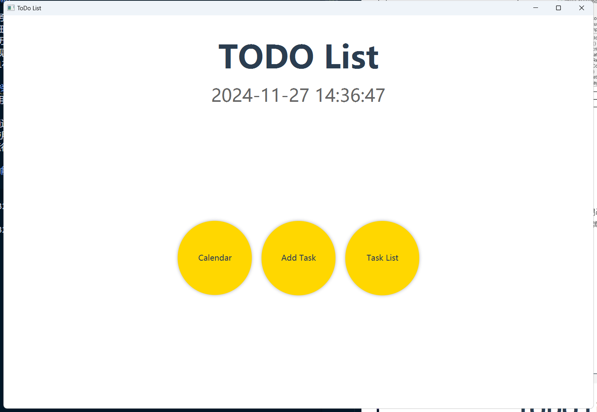
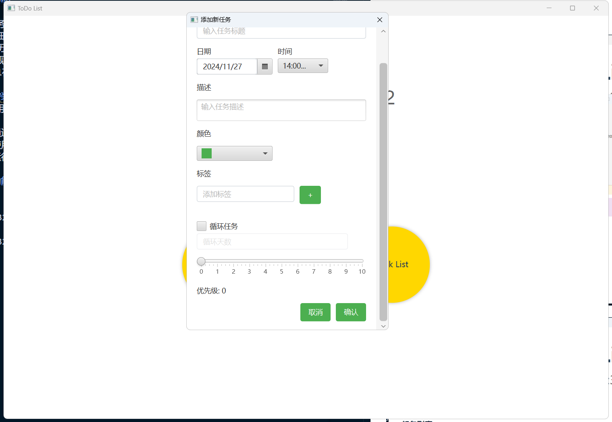
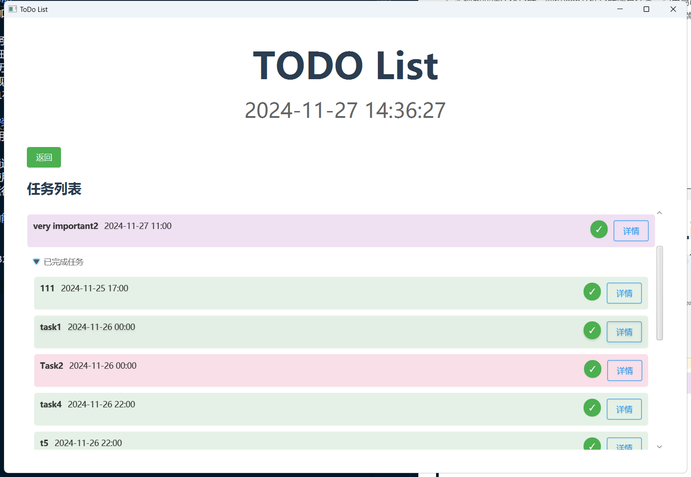
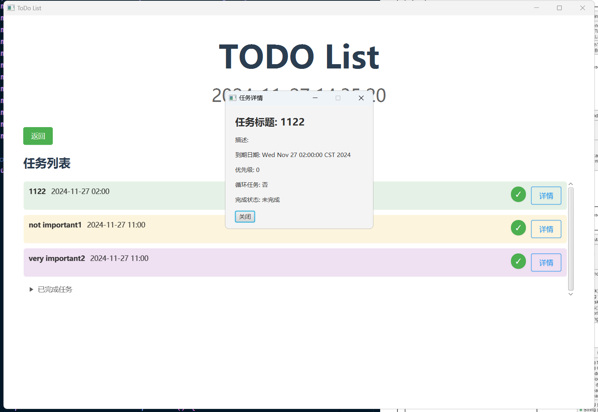
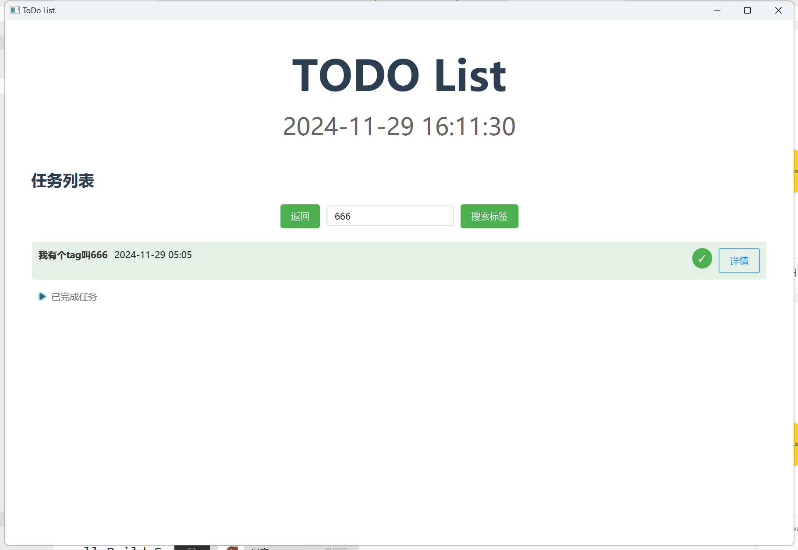
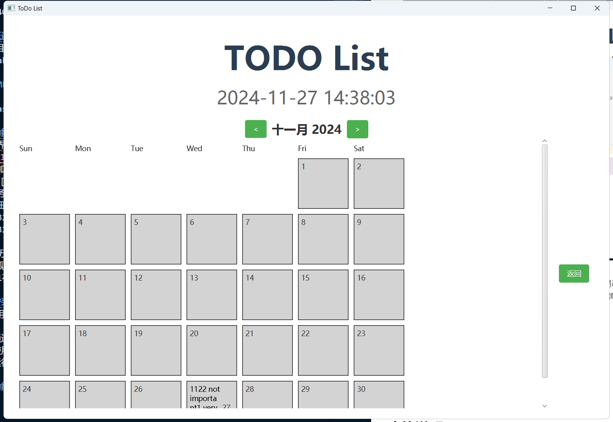
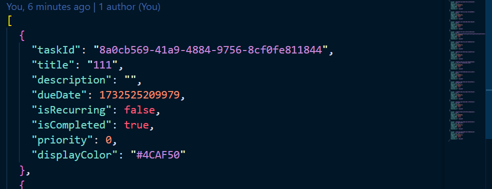
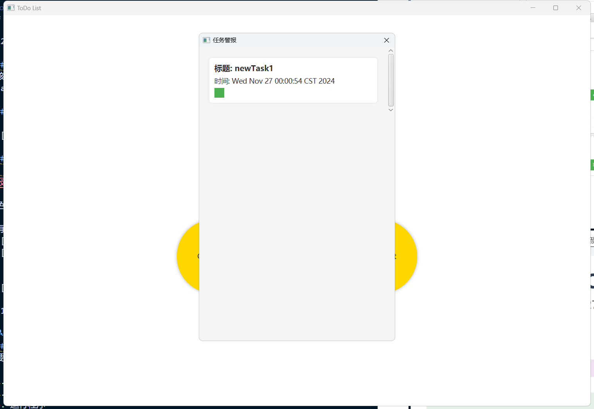
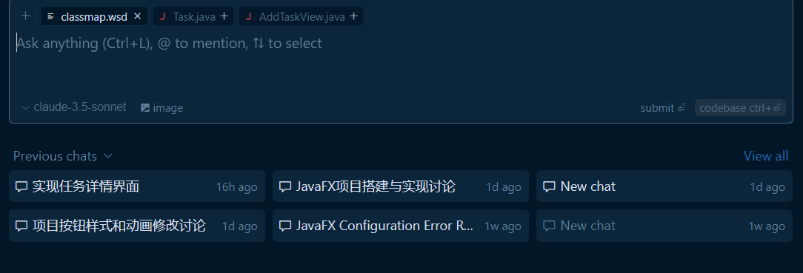

# 软件工程Lab3 实验报告

221240013 晁宇豪

概述

该项目旨在构建基础的TodoList应用。它使用Java语言以及经典的javaGUI框架JavaaFX实现，通过gradle实现项目的构建。

## UML类图(新版)



## 功能

- 主界面有三个按钮，日历，添加任务和任务列表。
- 添加任务可以添加任务的名称，详细描述，任务标签，日期，优先级，是否循环，以及任务的颜色。
- 任务列表按照优先级和日期的顺序显示任务的标题和颜色，点开可以显示该任务的所有详细信息。
  
  
- 同时可以完成任务归档，已完成的任务列表是可折叠的，而且可以通过任务标签进行筛选
  
- 日历界面可以显示相应日期下面的任务。
  
- 实现数据持久化存储，通过json文件存储所有任务，简单易改。 
- ddl在今日而且没有被完成的任务都会在启动软件的时候以弹窗的形式显示出来
  

## 安装&使用

要使用该项目，请按照以下步骤操作：

1. 克隆代码  `git clone https://github.com/chaoyuhao/todolist.git`
2. 通过 `Intellij IDEA` 打开项目
3. 使用 `gradle` 构建项目
4. 运行程序

## 软件架构

```
TODOFX/
├── src/
│   ├── main/
│   │   ├── java/
│   │   │   └── com/
│   │   │       └── todolist/
│   │   │           ├── model/
│   │   │           │   ├── Task.java
│   │   │           │   └── TaskManager.java
│   │   │           ├── view/
│   │   │           │   ├── MainView.java
│   │   │           │   ├── TaskListView.java
│   │   │           │   ├── TaskDetailView.java
│   │   │           │   ├── CalendarView.java
│   │   │           │   ├── AddTaskView.java
│   │   │           │   └── AlertView.java
│   │   │           └── Main.java
│   │   └── resources/
│   │       ├── css/
│   │       │   └── application.css
│   │       └── images/
│   │           └── (image files)
├── build.gradle
├── settings.gradle
└── 实验报告.md
```

其中Main.java提供了一个状态机用于管理目前是哪个View以及对初始的TaskManager进行实例化，MainView就是主界面，TaskListView是任务列表，TaskDetailView是显示任务信息的小窗口，CalendarView是日历视图，AddTaskView是弹出来的添加任务的小窗，AlertView是刚开始的时候进行报警的窗口，而Task就是对任务进行设计的类，TaskManager是对Task进行管理的类。

## 大模型的使用(Claude3.5-sonnet)

在这个实验中我使用的大模型，是cursor提供的Claude3.5-sonnet，编程能力在主流大模型中目前还是世界第一，非常无敌。因此本项目中无论是代码风格还是代码的质量都是非常可靠的。

我使用大模型的方法是通过先跟大模型确定项目大概的框架，然后设计好Main.java先提供可以可以运行的初始代码，并配置好环境依赖，然后自底向上(Claude给我的建议)逐层设计，同时每次进行改动之后我还会进行单元测试，然后修复一些界面美观问题以及debug。

当然整个过程中我确实用到了上个实验的UML图，就是每次聊的时候附件都会带上它


整个项目的代码行数：$1638$，但是留了一些TODO

```Powershell
Get-ChildItem -Recurse -Path .\src\ -Include *.* | Get-Content | Measure-Object -Line

Lines Words Characters Property
----- ----- ---------- --------
 1638
```

因此在本次实验中：

- 大模型帮我搭好了项目的框架以及大部分代码。
- 当大模型的表现不及预期的时候，我会跟它聊bug的细节，当遇到大模型无法修复的bug，我会出手。以及.css文件中的界面设计基本是由我来完成的，大模型的审美还是差点。

## 使用Git进行版本管理以及远程仓库的同步

本次实验中使用了git进行版本管理以及远程仓库的同步备份，同时使用了MIT License，实现了代码的开源。

我基本是每次做完一个View就进行一次commit，因此从git patch可以看到整个项目构建的过程。

代码可以通过 [https://github.com/chaoyuhao/todolist.git](https://github.com/chaoyuhao/todolist.git) 获取。
