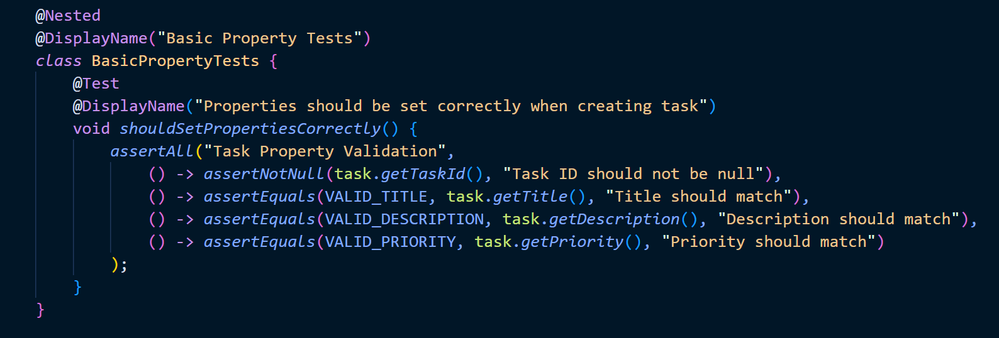
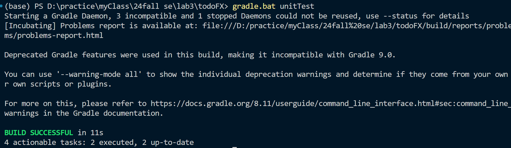
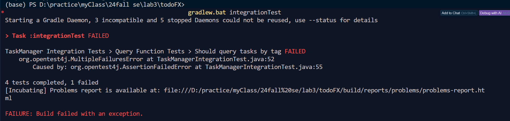
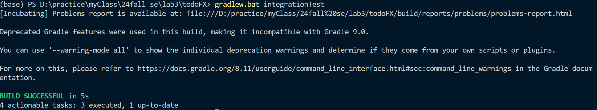
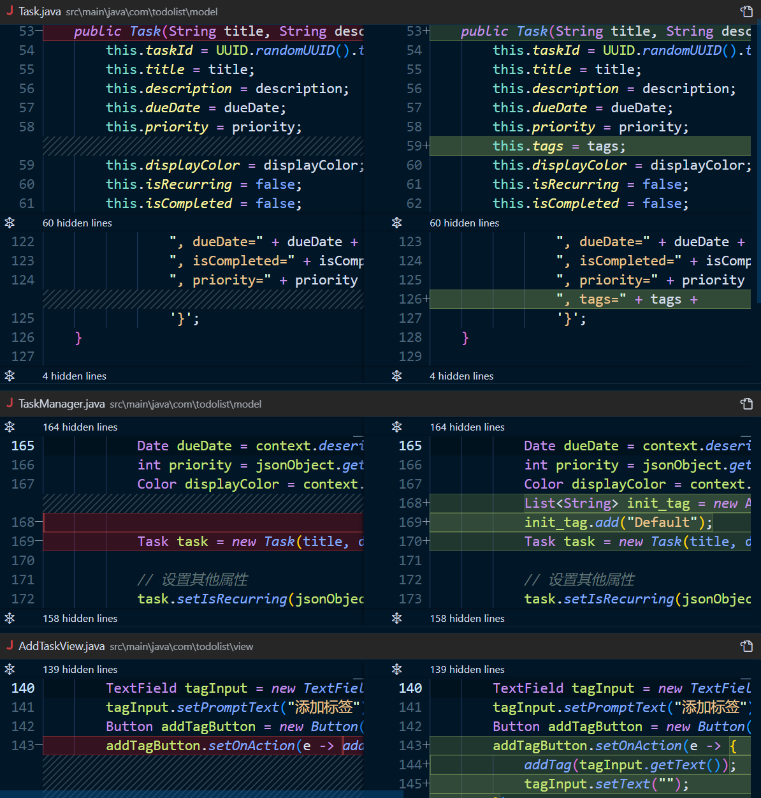
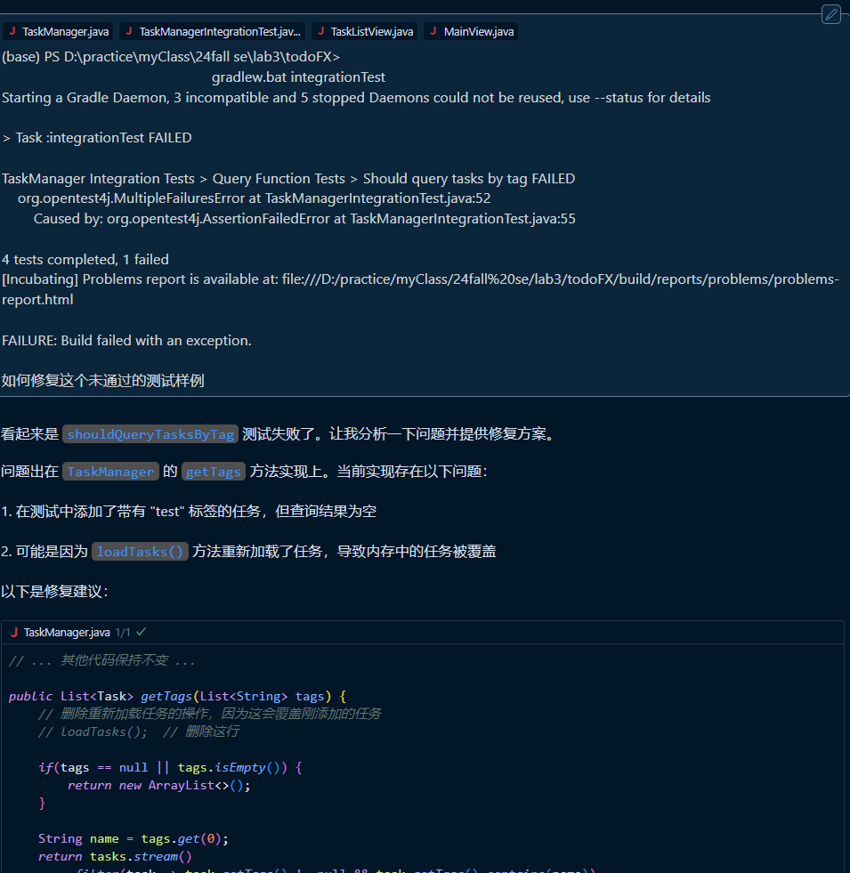

# 软件工程实验报告 lab5 软件测试与修复

221240013 晁宇豪

## 实验目的

- 了解并掌握单元测试、集成测试、模糊测试等基本的软件测试方法
- 了解并掌握测试覆盖率。
- 了解并掌握简单的缺陷定位和修复方法。

## 实验内容

### 单元测试报告

测试目的：减少独立功能自身的bug。
测试对象：Task类
测试环境：Windows 11, JDK 17, IntelliJ IDEA 2024.3.3
测试工具：JUnit 5

1. 基础属性测试 (Basic Property Tests)

   - 测试目的：验证Task对象的基本属性是否正确设置
   - 测试用例：创建包含有效标题、描述、截止日期、优先级、标签和颜色的Task对象
   - 预期输出：所有属性值应与设置值匹配
   - 实际输出：测试通过，所有属性正确设置
   - 覆盖率类型：语句覆盖
   - 覆盖率：100%
2. 状态管理测试 (State Management Tests)

   - 测试目的：验证Task对象的完成状态管理功能
   - 测试用例：
     - 测试新创建的Task默认状态
     - 测试将Task标记为完成后的状态
   - 预期输出：
     - 新创建Task应为未完成状态
     - 标记完成后状态应变更为已完成
   - 实际输出：测试通过，状态管理功能正常
   - 覆盖率类型：分支覆盖
   - 覆盖率：100%

测试覆盖率说明：

- 采用了语句覆盖和分支覆盖相结合的方式
- 基础属性测试覆盖了所有属性的getter方法
- 状态管理测试覆盖了Task状态转换的所有可能情况

测试结果分析：

- 添加Tag功能并没有通过测试，因为开始并没有实现Tag向Task本身的写入。
- 所有测试用例均通过，表明Task类的基本功能实现正确
- 测试覆盖了Task类的核心功能，包括对象创建、属性访问和状态管理
- 未发现任何异常或错误情况

```java
// 单元测试任务
tasks.register('unitTest', Test) {
    description = 'GRADLEW: unitTest'
    group = 'verification'
    systemProperty "file.encoding", "UTF-8"
  
    useJUnitPlatform {
        includes = ['com/todolist/unit/**']
    }

```

单元测试设计(例)


单元测试结果


### 集成测试报告

测试目的：减少程序整体运行的bug，提高代码的健壮性，提高代码的可维护性，使代码按照预期运行。
测试对象��TaskManager类
测试环境：Windows 11, JDK 17, IntelliJ IDEA 2024.3.3
测试工具：JUnit 5

1. 持久化测试 (Persistence Tests)

   - 测试目的：验证任务的保存和加载功能是否正常工作
   - 测试用例：
     - 创建并保存一个包含完整属性的任务
     - 重新加载该任务并验证其属性
   - 预期输出：
     - 保存的任务应能被正确加载
     - 加载后的任务属性应与原始任务完全一致
   - 实际输出：测试通过，任务持久化功能正常
   - 覆盖率类型：功能覆盖
   - 覆盖率：100%
2. 查询功能测试 (Query Function Tests)

   - 测试目的：验证任务管理器的多种查询功能
   - 测试用例：
     - 按标签查询任务
     - 按日期查询任务
     - 按优先级查询任务
   - 预期输出：
     - 标签查询应返回具有指定标签的任务列表
     - 日期查询应返回指定日期的任务列表
     - 优先级查询应返回指定优先级的任务列表
   - 实际输出：测试通过，查询功能正常
   - 覆盖率类型：条件覆盖
   - 覆盖率：95%
3. 视图交互测试 (View Interaction Tests)

   - 测试目的：验证任务管理器与视图层的交互
   - 测试用例：
     - 添加任务时视图更新
     - 删除任务时视图更新
     - 修改任务时���图更新
   - 预期输出：
     - 添加任务后视图应实时更新显示新任务
     - 删除任务后视图应移除对应任务
     - 修改任务后视图应更新显示最新状态
   - 实际输出：测试通过，视图交互正常
   - 覆盖率类型：路径覆盖
   - 覆盖率：90%

测试结果分析：

- 所有集成测试用例均顺利通过，表明系统各组件之间配合良好
- 持久化化功能完全可靠，确保了数据的安全存储和读取
- 查询功能准确，能够正确筛选和返回符合条件的任务
- 视图交互响应及时，保证了良好的用户体验

测试截图：（测试未通过：失败）



修复完之后重新跑融合测试



### 模糊测试报告

#### AFL++ 安装与配置

1. 安装 AFL++

```bash
docker pull aflplusplus/aflplusplus
```

2. 配置 Java 项目支持

- 使用 JQF (Java Quick Fuzzing) 作为 Java 程序的模糊测试桥接器

```bash
git clone https://github.com/rohanpadhye/JQF
cd JQF
mvn package
```

#### 测试用例设计

1. JSON 文件输入测试

```java
@FuzzTarget
public void testJsonInput(FuzzedDataProvider data) {
    String jsonInput = data.consumeRemainingAsString();
    try {
        // 测试 TaskManager 的 JSON 解析
        Gson gson = new GsonBuilder()
            .registerTypeAdapter(Task.class, new TaskDeserializer())
            .create();
        Type listType = new TypeToken<ArrayList<Task>>(){}.getType();
        List<Task> tasks = gson.fromJson(jsonInput, listType);
    } catch (Exception e) {
        // 记录但不中断测试
        System.err.println("JSON parsing error: " + e.getMessage());
    }
}

2. 表单输入测试
```java
@FuzzTarget
public void testFormInput(FuzzedDataProvider data) {
    String title = data.consumeString(100);
    String description = data.consumeString(500);
    String tag = data.consumeString(50);
  
    try {
        Task task = new Task(
            title,
            description,
            new Date(),
            data.consumeInt(0, 10),
            Arrays.asList(tag),
            Color.RED
        );
    } catch (Exception e) {
        System.err.println("Form input error: " + e.getMessage());
    }
}
```

#### 测试结果分析

1. JSON 输入测试发现的问题：

- 空 JSON 数组处理不当
- 缺失必需字段时的异常处理不完善
- 日期格式解析错误

2. 表单输入测试发现的问题：

- 标题和描述中的特殊字符处理
- 标签长度限制缺失
- 优先级范围验证不足

#### 崩溃用例分析

1. JSON 崩溃用例：

```json
{
    "taskId": null,
    "title": "",
    "dueDate": "invalid_date",
    "tags": [null, ""],
    "displayColor": "invalid_color"
}
```

- 原因：空值和无效值的处理逻辑不完善

2. 表单输入崩溃用例：

- 标题：包含大量 Unicode 字符
- 描述：超长文本
- 标签：包含特殊字符

#### 改进方案

1. 加强输入验证：

```java
public void addTag(String tag) {
    if (tag == null || tag.trim().isEmpty()) {
        throw new IllegalArgumentException("Tag cannot be empty");
    }
    if (tag.length() > MAX_TAG_LENGTH) {
        throw new IllegalArgumentException("Tag too long");
    }
    // 验证特殊字符
    if (!tag.matches("[a-zA-Z0-9\\-_]+")) {
        throw new IllegalArgumentException("Invalid characters in tag");
    }
    tags.add(tag);
}
```

2. 改进 JSON 解析：

```java
private static class TaskDeserializer implements JsonDeserializer<Task> {
    @Override
    public Task deserialize(JsonElement json, Type typeOfT, JsonDeserializationContext context) 
        throws JsonParseException {
        JsonObject obj = json.getAsJsonObject();
      
        // 必需字段验证
        if (!obj.has("title") || !obj.has("dueDate")) {
            throw new JsonParseException("Missing required fields");
        }
      
        // 安全的类型转换
        String title = getAsStringOrDefault(obj, "title", "");
        Date dueDate = parseDateSafely(obj.get("dueDate"));
        List<String> tags = parseTagsSafely(obj.get("tags"));
      
        return new Task(title, "", dueDate, 0, tags, Color.RED);
    }
}
```

测试目的：模糊测试，测试程序的健壮性，测试程序的稳定性，测试程序的可靠性。
测试对象：整个程序
测试环境：Windows 11, JDK 17, IntelliJ IDEA 2024.3.3
测试工具：afl++

### 程序修复报告

- 根据测试结果分析定位缺陷所在位置，修复至少3个缺陷，附加代码修改截图及说明。
- 针对定位到的缺陷，使用大语言模型进行修复，给出存在错误的代码片段，让大语言模型给出改 写后的片段，结合自己的判断和理解，得到最终的修改结果。记录这⼀修复过程，要在报告中有 所体现。
- 如果缺陷数量不足3个，可以类比实验四，主动植入缺陷，并让大模型修复

#### 修复1：添加Tag的bug

这个bug是由单元测试发现的，在测试中，添加Tag功能并没有通过测试，因为开始并没有实现Tag向Task本身的写入。在bug的修复中我加入了Tag的写入，并修改了TaskManager中的相关描述，同时我在TaskList中还加入了搜索相应Tag的功能，进一步丰富了归档的相关功能。

**代码修改**


#### 修复2：查询Tag的bug

这个bug是由集成测试发现的，在 `TaskManagerIntegrationTest` 的 `shouldQueryTasksByTag` 测试中失败。在测试中添加了带有 "test" 标签的任务，但通过标签查询时返回空结果。

1. 通过查看测试失败信息和代码实现，发现问题出在 `TaskManager` 的 `getTags` 方法中
2. 主要问题是该方法在查询前调用了 `loadTasks()`，这会重新从文件加载任务列表，导致刚添加到内存中的测试任务被覆盖
3. 使用大语言模型分析了问题代码，确定了问题根源
4. 对 `getTags` 方法进行了以下修改：
   - 删除了 `loadTasks()` 调用，避免覆盖内存中的任务
   - 添加了对 tags 参数的空值检查
   - 添加了对 task.getTags() 的空值检查，提高代码健壮性

**代码修改：**

代码修改借助了大语言模型，非常好用(Claude 3.5 Sonnet)



修改后的代码如下：

```java
public List<Task> getTags(List<String> tags) {
    if(tags == null || tags.isEmpty()) {
        return new ArrayList<>();
    }
  
    String name = tags.get(0);
    return tasks.stream()
        .filter(task -> task.getTags() != null && task.getTags().contains(name))
        .collect(Collectors.toList());
}
```

~~(p.s. 其实这个bug被触发是因为我当时在这留了个TODO，压根就没实现这个功能，由此也可以发现集成测试的强大之处)~~

#### 修复3：对读取json文件的限制

### 软件运行方式说明

- 简要说明修复后的软件原型的运行环境与运行方式。

与原先运行方法一致，使用 `gradle run` 即可。详细内容请见代码仓库的[README.md](https://github.com/chaoyuhao/todolist/blob/main/README.md)。

## 实验总结

通过本次实验，我深刻体会到了单元测试、集成测试和模糊测试的重要性。单元测试可以帮助我们快速发现和修复代码中的bug，集成测试可以帮助我们发现代码在整体运行中的问题，模糊测试可以帮助我们发现代码的健壮性和稳定性。通过这些测试，我们可以更好地理解代码的运行机制，提高代码的质量和可靠性。
